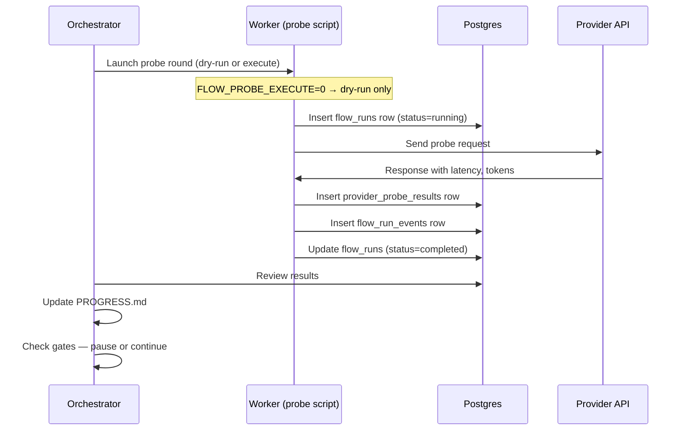

# Flow Control Plane

> **Status:** Scaffold — implement tables and probe loops as needed  
> **Philosophy:** Observable long-running loops for provider evals, routing health, cost monitoring, and self-host operations.  
> **Differentiator:** This is what Makora cannot offer — a transparent, inspectable control plane over the inference gateway.

---

## Why a Control Plane?

Makora is a black box: you send a request, you get a response, and you have zero
visibility into provider health, routing decisions, cost per model, or whether
fallbacks are working. Flow flips that model.

The **Flow Control Plane** is the set of persistence tables, probe scripts, and
observability loops that make Flow's internal operation **visible, auditable,
and controllable**.

| Capability | Makora | Flow |
|---|---|---|
| Provider health visibility | ❌ None | ✅ `provider_probe_results` table |
| Routing decision trace | ❌ None | ✅ `flow_run_events` with evidence |
| Cost per model | ❌ Hidden | ✅ `estimated_cost_usd` in runs |
| Latency breakdown | ❌ None | ✅ `latency_ms`, `ttft_ms`, model-level |
| Pause/resume fallback routes | ❌ None | ✅ Human gates in PROGRESS |
| Self-host lane management | ❌ N/A | ✅ Control plane tables |

---

## Architecture: Orchestrator / Worker Split

```
┌────────────────────────────────────────────────────┐
│                  Orchestrator                      │
│  (read-only: plans probes, reviews results,        │
│   updates PROGRESS.md, pauses/resumes routes)      │
│                                                     │
│  - Reads from DB tables                             │
│  - Writes to PROGRESS.md (source of truth file)     │
│  - Launches worker runs via Pi or CLI               │
└────────────┬───────────────────────────┬────────────┘
             │                           │
    plan     │                    execute │
             ▼                           ▼
┌──────────────────────┐   ┌──────────────────────────┐
│  Worker: Probe       │   │  Worker: Route Health    │
│  Runs provider       │   │  Pings each upstream     │
│  evals, records      │   │  endpoint, records       │
│  latency/cost        │   │  score/error             │
└──────────────────────┘   └──────────────────────────┘
```

### Orchestrator (Read-Only)
- Plans which provider probes to run
- Reviews probe results from DB
- Updates `PROGRESS.md` with state
- Sets human gates (pause signals)
- **Never writes to DB directly** — workers handle that

### Workers (Executor)
- Execute provider probes (API calls when permitted)
- Record results into `provider_probe_results`
- Execute route health checks → `provider_route_scores`
- Record run lifecycle in `flow_runs` / `flow_run_events`

---

## Source of Truth: PROGRESS.md + Database

| Data | Source | Why |
|---|---|---|
| Human-readable loop state | `control-plane/PROGRESS.md` | Easy review, git-tracked, no DB needed |
| Machine-queryable history | Postgres tables | Analytics, dashboards, correlation |
| Gate/pause decisions | `PROGRESS.md` `## Gates` section | Human-readable, commit-triggered CI |

The dual approach means you can glance at `PROGRESS.md` for the current state
without running a query, and query the DB for historical trends.

---

## Human Gates

A **gate** is a documented pause point where the orchestrator halts loop
execution and asks a human to review before proceeding. Gates are recorded in
`PROGRESS.md` under `## Gates`:

```markdown
## Gates

### GATE-001: Provider Probe — Round 1
**Status:** OPEN  
**Description:** Review initial probe results for Fireworks AI, DeepInfra, Makora  
**Criteria to close:**
- At least 3 successful probes per provider
- No timeout errors > 2s
- Cost per model within budget
**Closed by:** <name> on 2026-06-20
```

Gates prevent the control plane from making automated decisions that could
incur unexpected costs or degrade service.

---

## Tables Overview

See [`control-plane/schema.sql`](../control-plane/schema.sql) for DDL.

| Table | Role |
|---|---|
| `flow_runs` | Top-level run (e.g. "provider probe round 1") |
| `flow_run_events` | Step-level events within a run |
| `provider_probe_results` | Individual probe measurements (latency, cost, tokens) |
| `provider_route_scores` | Route health scores per provider |

---

## Probe Loop



---

## Self-Host Ops

When self-hosted vLLM nodes are deployed, the control plane tracks:

- `provider = 'self-hosted-vllm'` in `provider_probe_results`
- `provider = 'self-hosted-vllm'` in `provider_route_scores`
- Separate cost tracking (electricity/rent vs API cost)
- Node health pings via route scores

This makes the self-host lane a **first-class citizen** alongside external
providers in the control plane, enabling data-driven decisions about when to
shift traffic from paid providers to owned capacity.

---

## Related

- [Cole Agent Control Plane Notes](cole-agent-control-plane-notes.md) — the pattern
  that inspired this design
- [`control-plane/schema.sql`](../control-plane/schema.sql)
- [`control-plane/PROGRESS.example.md`](../control-plane/PROGRESS.example.md)
- [`scripts/provider-probe-plan.sh`](../scripts/provider-probe-plan.sh)
- [Service Strategy](service-strategy.md)
